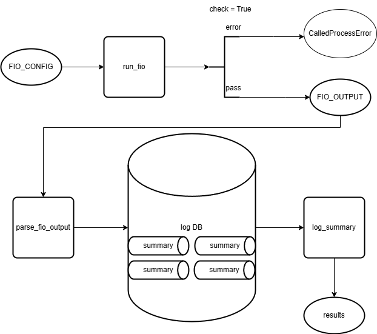

# System-Testing

Automated system-level testing framework designed for hardware and software validation in embedded and endpoint environments. This project demonstrates proficiency in Python-based test automation, CI integration, and data-driven diagnostics.

---

## 🔍 Overview

This framework is built to automate testing of system-level components such as CPU telemetry, power consumption, and thermal profiles. It is designed for modularity, reusability, and data visibility—ideal for environments where hardware/software integration needs repeatable, scalable validation.

Key goals:
- Enable repeatable functional and stress testing
- Automate test execution and data capture
- Validate hardware/firmware behavior under load
- Integrate with CI tools like Jenkins for continuous test feedback

---

## ⚙️ Features

- ✅ Modular Python test scripts with CLI interface  
- ✅ Telemetry checks: Raw block devices, filesystem preformance, network storage, custom I/O engines 
- ✅ JSON-based logging of test results  
- ✅ Jenkins-compatible structure for pipeline execution  
- ✅ Utility functions for statistical analysis using NumPy/Pandas  
- ✅ Color-coded terminal output for quick test summaries  

---

## 🧰 Tech Stack

- **Language:** Python 3.10  
- **Libraries:** `subprocess`, `argparse`, `pandas`, `numpy`, `json`, `matplotlib`  
- **Tools:**  Git, Jenkins 

---

## 📂 Project Structure

---

## 🚀 Getting Started

### Requirements
- Python 3.10+
- Install dependencies:
pip install -r requirements.txt

## Configure
Configure .fio to specify test and target device
- Change filename path to whatever target devive being tested
  - filename= "Target device"

### Run a test
(Basic test) python fiotest.py

(Advance test with visual data) python fio_analysis_tool.py

### View logs
Logs are saved as JSON in `/logs` and can be parsed for dashboards or trend analysis.

---

## 📈 Sample Output

Running fio with config: nvme_test_win.fio

FIO Test Summary:
----------------
Job: job_randread
  Read : 6073 IOPS | 23.72 MB/s | 5186.63 µs latency
  Write: 24758 IOPS | 96.71 MB/s | 1267.84 µs latency
------------------------------------------------------------

---

## ✅ Why It Matters

This project showcases:
- Hands-on experience with Python test automation
- Real-world validation logic 
- Use of statistical libraries for performance tracking
- CI pipeline readiness and modular structure

Ideal for roles in test engineering, validation, SDET, or DevOps with a hardware interface.

---

## 📬 Contact

Ralph Walker II  
📧 ralph.o.walkerii@gmail.com  
🔗 [LinkedIn](https://www.linkedin.com/in/ralph-walker-ii-a704a1a6)
